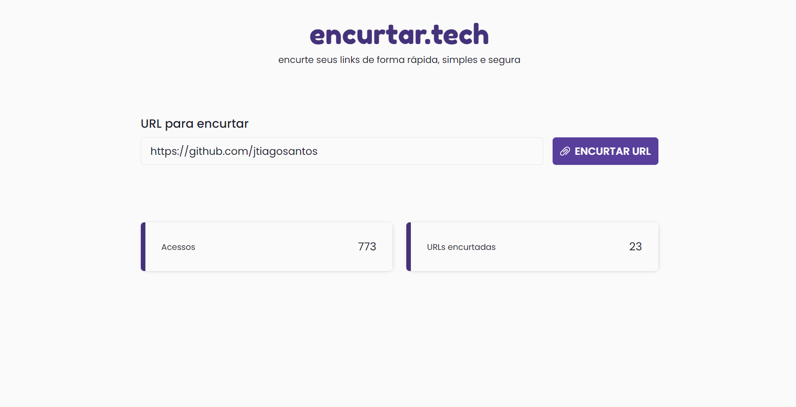
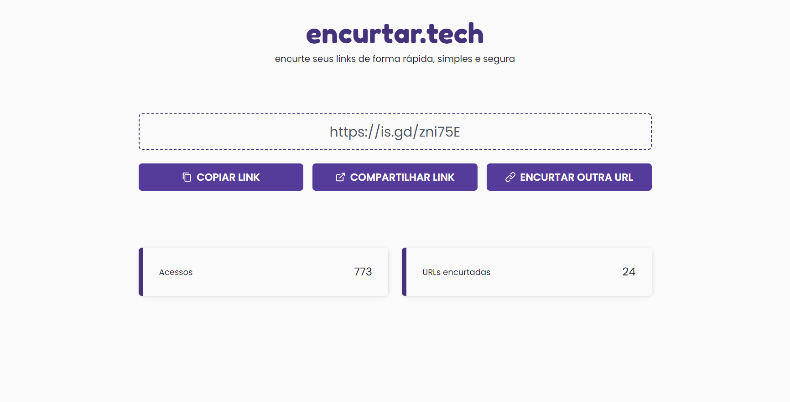

<h1 align="center">encurtar.tech</h1>

<p align="center">
  
  
  <a href="https://github.com/jtiagosantos/encurtar.tech/commits/master">
    
  </a>
  
   <a href="https://github.com/jtiagosantos/encurtar.tech/stargazers">
    
  </a>
</p>

<h4 align="center"> 
  🚧 encurtar.tech 🔗 Completed 🚀 🚧
</h4>

<p align="center">
  <a href="#-features">Features</a> •
  <a href="#-run-project">Run Project</a> • 
  <a href="#-run-storybook">Run Storybook</a> • 
  <a href="#-technologies">Technologies</a> • 
  <a href="#-docs">Docs</a> •
  <a href="#-author">Author</a> • 
  <a href="#-license">License</a>
</p>

<br>

<h1 align="center">
  
</h1>

<h1 align="center">
  
</h1>

## ⚙️ Features

- [x] Shorten a URL
- [x] Share a shortened URL
- [x] Copy a shortened URL to clipboard
- [x] View access count  
- [x] View shortened URLs count
- [x] Storybook  

<br>

## 🚀 Run Project

1️⃣ Clone project and access its folder:

```bash
$ git clone https://github.com/jtiagosantos/encurtar.tech.git
$ cd encurtar.tech
```

2️⃣ Install dependencies:

```bash
$ yarn
```

3️⃣ Start project:

```bash
$ yarn dev
```

<br>

## 🚀 Run Storybook

```bash
$ yarn storybook
```

<br>


## 🛠 Technologies

The following tools were used in the construction of project:

- **[Next.js](https://nextjs.org/docs/getting-started)**
- **[UpStash](https://docs.upstash.com/redis)**
- **[Is.gd](https://is.gd/developers.php)**
- **[Typescript](https://www.typescriptlang.org/)**
- **[ChakraUI](https://chakra-ui.com/getting-started)**
- **[Axios](https://axios-http.com/docs/intro)**
- **[IORedis](https://www.npmjs.com/package/ioredis)**
- **[Storybook](https://storybook.js.org/docs/react/get-started/introduction)**
- **[Storybook Deployer](https://github.com/storybookjs/storybook-deployer)**
- **[Husky](https://typicode.github.io/husky/#/)**

<br>

## 📝 Docs

You can view the storybook documentation through the link below:

- **[Storybook](https://jtiagosantos.github.io/encurtar.tech/)**

<br>

## 👨‍💻 Author


<strong><a href="https://github.com/jtiagosantos">Tiago Santos </a>🚀</strong>

[](https://www.linkedin.com/in/josetiagosantosdelima/)
[](mailto:tiago.santos@icomp.ufam.edu.br)

<br>

## 📝 License

This project is under license [MIT](./LICENSE).
